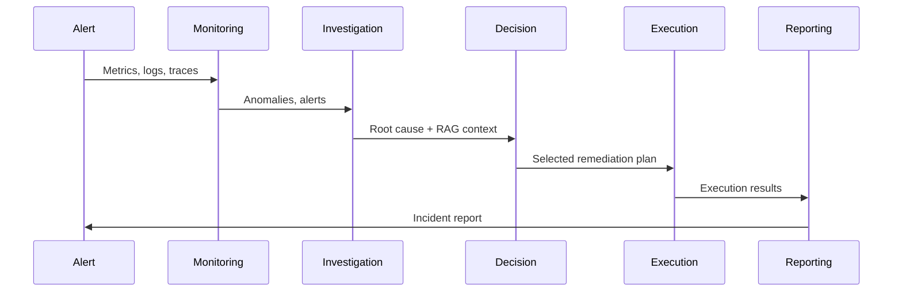

# SentinelAI

**Autonomous AI Site Reliability Engineering Platform**

SentinelAI acts as an AI SRE capable of monitoring cloud infrastructure, detecting incidents, performing root-cause analysis, selecting remediation strategies, executing automated recovery, and generating incident reports.


## Features

| Capability | Description |
|------------|-------------|
| **Multi-Agent AI** | LangGraph orchestration: Monitoring → Investigation → Decision → Execution → Reporting |
| **Monitoring** | Log/metric ingestion, anomaly detection, threshold alerts, latency tracking |
| **RAG** | Runbook and architecture doc indexing with Pinecone semantic retrieval |
| **Execution** | K8s pod restart, ECS rollback, autoscaling, service restart, traffic reroute |
| **Observability** | Prometheus, Grafana-ready metrics, OpenTelemetry, agent reasoning logs |
| **Evaluation** | Hallucination, root-cause accuracy, remediation success, resolution time scoring |
| **Security** | JWT auth, RBAC, audit logs, multi-tenant isolation |

## Quick Start

### Prerequisites

- Docker & Docker Compose
- Node.js 20+
- Python 3.12+
- (Optional) OpenAI API key, Pinecone API key

### 1. Configure Environment

```bash
cp .env.example .env
# Edit .env with your API keys
```

### 2. Start Infrastructure

```bash
docker compose up -d
```

Services:
- **API**: http://localhost:8000 (docs at /docs)
- **Frontend**: http://localhost:3000
- **Prometheus**: http://localhost:9090
- **PostgreSQL**: localhost:5432
- **Redis/Kafka**: internal

### 3. Run Frontend (development)

```bash
cd frontend && npm install && npm run dev
```

### 4. Seed Mock Data

```bash
pip install httpx
python scripts/seed-mock-data.py
```

### Demo Login

```
Email: admin@sentinelai.io
Password: (any - demo mode)
```

## Project Structure

```
sentinelai/
├── backend/                 # FastAPI + LangGraph + Celery
│   ├── app/
│   │   ├── agents/        # 5 AI agents + graph orchestration
│   │   ├── api/v1/        # REST API routes
│   │   ├── core/          # Auth, logging, observability, resilience
│   │   ├── services/      # RAG, anomaly detection, incidents
│   │   ├── workers/       # Celery tasks
│   │   └── models/        # SQLAlchemy models
│   └── tests/
├── frontend/              # Next.js 15 + Tailwind + Recharts
│   └── src/
│       ├── app/           # Pages (dashboard, incidents, agents...)
│       └── components/
├── infrastructure/
│   ├── kubernetes/        # K8s manifests
│   ├── terraform/         # AWS VPC, EKS, RDS, Redis, MSK
│   ├── prometheus/
│   └── otel/
├── samples/               # Runbooks, mock events, architecture docs
├── docs/                  # System design, deployment, evaluation
└── scripts/
```

## Agent Pipeline



## API Endpoints

| Method | Path | Description |
|--------|------|-------------|
| POST | `/api/v1/auth/login` | JWT authentication |
| GET | `/api/v1/incidents` | List incidents |
| POST | `/api/v1/incidents/trigger` | Run full agent pipeline |
| POST | `/api/v1/monitoring/metrics/ingest` | Ingest metrics |
| POST | `/api/v1/monitoring/logs/ingest` | Ingest logs |
| GET | `/api/v1/agents/activity` | Agent reasoning feed |
| POST | `/api/v1/remediation/{id}/approve` | Approve action |
| POST | `/api/v1/evaluation/score` | AI quality scoring |
| GET | `/api/v1/metrics` | Prometheus metrics |

## Documentation

- [Architecture Overview](docs/architecture.md)
- [System Design](docs/system-design.md)
- [Scaling Strategy](docs/scaling-strategy.md)
- [AI Evaluation Strategy](docs/ai-evaluation.md)
- [Observability Guide](docs/observability.md)
- [Production Deployment](docs/deployment-guide.md)

## Production Deployment

See [docs/deployment-guide.md](docs/deployment-guide.md) for:
- Kubernetes deployment
- Terraform infrastructure provisioning
- GitHub Actions CI/CD pipeline
- Secrets management
- Horizontal scaling configuration

## License

Proprietary - SentinelAI Platform
