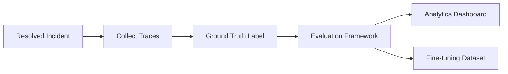

# AI Evaluation Strategy

## Evaluation Dimensions

| Metric | Weight | Description |
|--------|--------|-------------|
| Hallucination Score | 25% | Are agent claims grounded in tool results? |
| Root Cause Accuracy | 35% | Does hypothesis match actual root cause? |
| Remediation Success | 25% | Did automated actions resolve the incident? |
| Resolution Time | 15% | Time from detection to resolution |

## Scoring Methodology

### Hallucination Score (0-1, higher = better)

```
score = 0.5 + (tool_backed_traces / total_traces) * 0.5
```

A trace is "tool-backed" if it includes `tool_calls` from Prometheus, log search, or RAG retrieval.

### Root Cause Accuracy

Semantic overlap between predicted and actual root cause (word overlap proxy). In production, use embedding similarity:

```
accuracy = cosine_similarity(embed(predicted), embed(actual))
```

### Remediation Success

Binary: 1.0 if `execution_success == true`, else 0.0. Partial credit for fallback success.

### Resolution Time Score

```
time_score = max(0, 1 - (resolution_seconds / 900))
```

Target: resolve within 15 minutes.

## Evaluation Pipeline



## Continuous Improvement Loop

1. **Collect**: Store all reasoning traces with incident outcomes
2. **Label**: SRE team labels actual root cause post-resolution
3. **Score**: Run `POST /api/v1/evaluation/score` batch job nightly
4. **Analyze**: Track scores in Analytics dashboard
5. **Improve**: Use low-scoring incidents for prompt tuning and runbook updates

## Quality Thresholds

| Metric | Target | Alert |
|--------|--------|-------|
| Overall Score | > 0.85 | < 0.70 |
| Hallucination | > 0.80 | < 0.60 |
| Root Cause Accuracy | > 0.80 | < 0.65 |
| Remediation Success | > 0.90 | < 0.75 |

## Human Evaluation

Monthly review of 20 random incidents:
- SRE rates root cause correctness (1-5)
- Operator rates remediation appropriateness (1-5)
- Compare with automated scores for calibration

## Regression Testing

```bash
cd backend && pytest tests/test_agents.py -v
```

Test suite validates:
- Full pipeline completes
- All 5 agents produce traces
- Root cause hypothesis generated
- Retry logic on execution failure

## Bias and Safety Checks

- Flag remediations with `risk_assessment: high` for 100% human review
- Block execution of destructive actions without approval
- Log all LLM prompts and responses for audit
