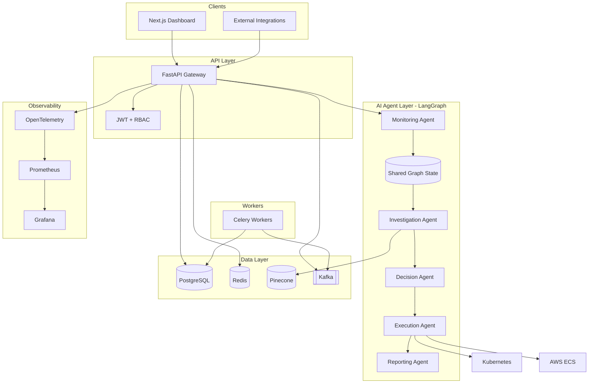

# SentinelAI Architecture

## High-Level Architecture

## Component Responsibilities

### Frontend (Next.js 15)
- Enterprise dark-theme operations dashboard
- Live incident management
- Agent activity feed and reasoning timeline
- Infrastructure health panel
- Remediation approval workflow
- Analytics with Recharts

### Backend (FastAPI)
- REST API with typed Pydantic schemas
- JWT authentication with RBAC (viewer, operator, admin)
- Multi-tenant data isolation
- Audit logging for compliance

### AI Agents (LangGraph)
All agents communicate through `IncidentGraphState`:

| Agent | Input | Output |
|-------|-------|--------|
| Monitoring | Metrics, logs, traces | Anomalies, threshold alerts, latency issues |
| Investigation | Monitoring output + RAG | Root cause hypothesis, confidence score |
| Decision | Investigation output | Remediation plans, risk assessment |
| Execution | Selected plan | Action results, rollback flag |
| Reporting | Full pipeline state | Incident report, post-mortem |

### Event Streaming (Kafka)
Topics: `sentinel.metrics`, `sentinel.logs`, `sentinel.incidents`, `sentinel.actions`

### Task Queue (Celery + Redis)
Queues: `default`, `execution`, `monitoring`

## Data Flow

1. **Ingestion**: Metrics/logs arrive via API or Kafka
2. **Detection**: Anomaly detector flags outliers; thresholds trigger alerts
3. **Incident Creation**: Alert creates incident record in PostgreSQL
4. **Pipeline**: LangGraph executes 5-agent workflow with shared state
5. **Approval**: High-risk actions require operator approval
6. **Execution**: Celery workers execute infrastructure actions
7. **Reporting**: Final agent generates incident report and evaluation scores

## Security Architecture

- JWT tokens with tenant_id and role claims
- Row-level tenant isolation on all queries
- Audit log for all state-changing operations
- Remediation approval gate for production actions
- Secrets via K8s Secrets / AWS Secrets Manager
