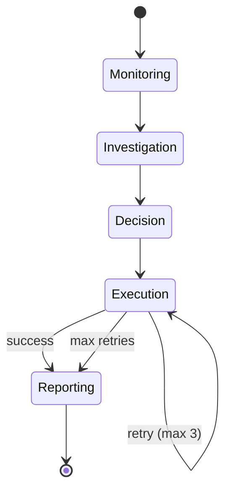
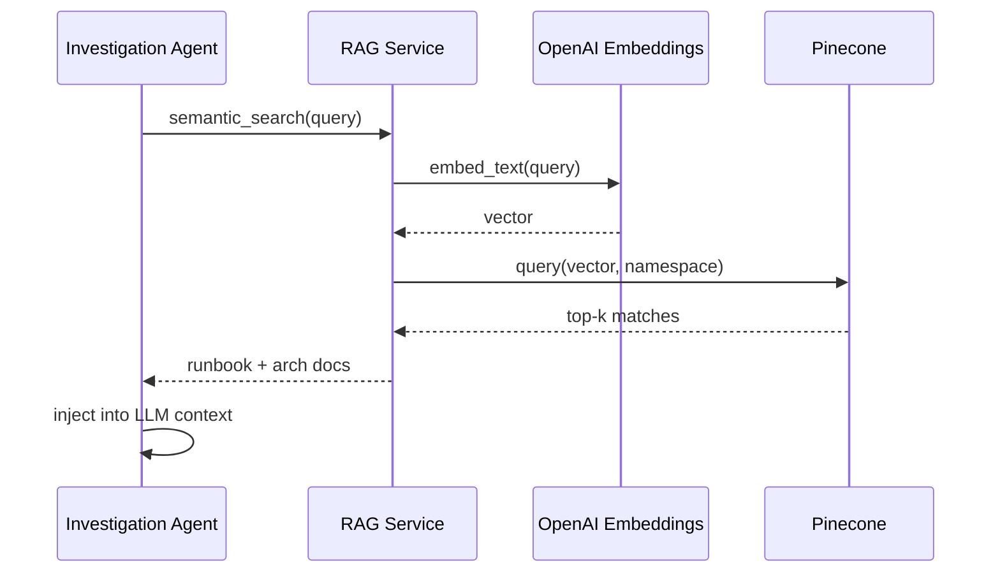

# SentinelAI System Design

## Design Goals

1. **Autonomous**: Minimize human intervention for routine incidents
2. **Observable**: Full reasoning trace for every agent decision
3. **Safe**: Human-in-the-loop for high-risk production actions
4. **Scalable**: Horizontally scale API, workers, and agents
5. **Evaluable**: Continuous AI quality measurement

## Agent State Machine

### Shared State Schema

The `IncidentGraphState` TypedDict carries:
- Identity: `incident_id`, `tenant_id`
- Signals: `metrics`, `logs`, `traces`
- Per-agent outputs with annotated reducers for traces and plans
- Orchestration: `retry_count`, `errors`, `execution_memory`

### Retry and Fallback Logic

- **Retries**: Tenacity decorator on execution with exponential backoff
- **Circuit Breaker**: External service calls (Prometheus, K8s API)
- **Fallback**: If primary remediation fails, Decision agent's alternate plans execute (e.g., autoscale after pod restart failure)

## RAG Pipeline

Namespaces:
- `runbooks` - Operational procedures
- `architecture` - System design documents

## Database Schema

| Table | Purpose |
|-------|---------|
| incidents | Incident lifecycle and RCA results |
| reasoning_traces | Per-agent reasoning logs |
| remediation_actions | Action status and approval |
| metric_events | Time-series metric storage |
| log_events | Structured log storage |
| audit_logs | Security/compliance audit trail |
| users / tenants | Multi-tenant identity |

## API Design Principles

- Versioned under `/api/v1`
- Consistent error responses with correlation IDs
- Pagination on list endpoints
- Role-based access on mutating endpoints
- Prometheus metrics at `/api/v1/metrics`

## Technology Choices

| Component | Choice | Rationale |
|-----------|--------|-----------|
| Orchestration | LangGraph | Native state machine, checkpointing, retries |
| API | FastAPI | Async, OpenAPI, Python AI ecosystem |
| Events | Kafka | Durable streaming for high-throughput telemetry |
| Tasks | Celery | Mature distributed task execution |
| Vectors | Pinecone | Managed, low-latency semantic search |
| Frontend | Next.js 15 | SSR, App Router, enterprise React |
